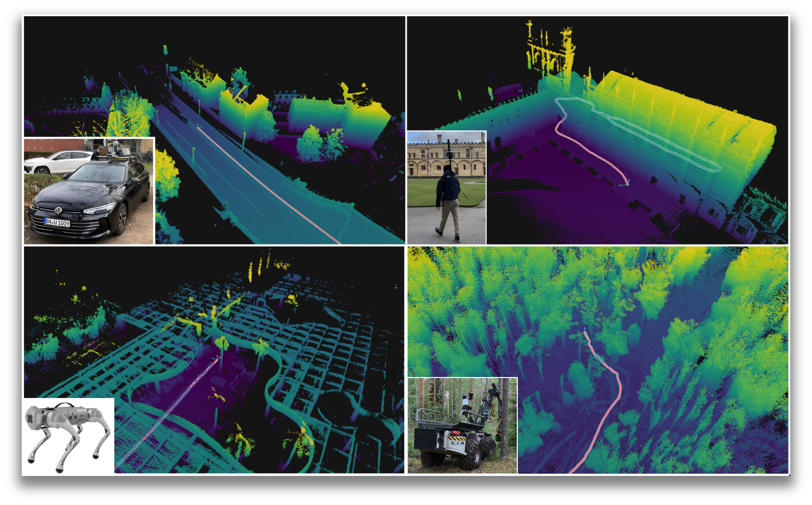

RKO-LIO - LiDAR-Inertial Odometry
=================================

.. raw:: html

  

    

      
      
      
      
    

  

   *Four different platforms, four different environments, one odometry system*

RKO-LIO is a LiDAR-inertial odometry system that is by design simple to deploy on different sensor configurations and robotic platforms with as minimal a change in configuration as necessary.

There is no restriction on which LiDAR you can use, and you can do so without changing any config (I've tested Velodyne, Ouster, Hesai, Livox, Robosense, Aeva sensors).
For using an IMU, I require only the accelerometer and gyroscope readings, the bare minimum.
You don't need to look up manufacturer spec sheets to provide noise specifications, etc.

All you need to provide is the extrinsic transformation between the IMU and LiDAR and you can start using the system for your LiDAR-inertial odometry needs!

.. note::
   This documentation is still under construction. If you see something you can improve, I'd greatly appreciate any help. Please make an issue or a PR on `GitHub <https://github.com/PRBonn/rko_lio>`__!

Citation
^^^^^^^^

If you use this work, please leave a star ⭐ on our `GitHub repository <https://github.com/PRBonn/rko_lio>`_ and consider citing:

.. code-block:: bibtex

  @article{malladi2025arxiv,
    author      = {M.V.R. Malladi and T. Guadagnino and L. Lobefaro and C. Stachniss},
    title       = {A Robust Approach for LiDAR-Inertial Odometry Without Sensor-Specific Modeling},
    journal     = {arXiv preprint},
    year        = {2025},
    volume      = {arXiv:2509.06593},
    url         = {https://arxiv.org/pdf/2509.06593},
  }

.. toctree::
   :maxdepth: 2
   :caption: Contents:

   Primer <pages/primer>
   Quickstart <pages/quickstart>
   Data <pages/data>
   ROS <pages/ros/ros>
   Python <pages/python/python>
   Configuring rko_lio <pages/config>
   Uncategorised <pages/uncategorised/index>
   License <__LICENSE>
