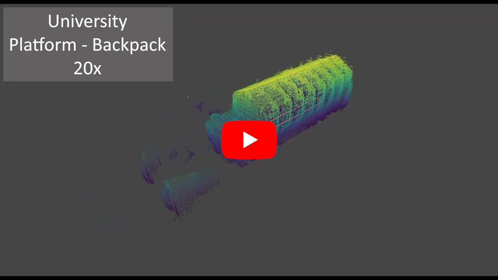

A short primer
==============

You can use RKO-LIO in two primary ways:

1. **Offline** using the Python application ``rko_lio`` for analyzing pre-recorded data.
2. **Online** on a robot via our ROS packages.

The ROS-based system is the recommended approach for using RKO-LIO.
Online or even offline, as we provide additional nodes to process ROS bags directly as well (see *offline mode* in :doc:`ROS Usage <ros/usage>`).
It offers **better performance** due to more efficient handling of incoming data streams.
If possible, prefer using the ROS version.
The Python version is intended mainly for convenience.

For a short demo of RKO-LIO, you can check this YouTube video:

