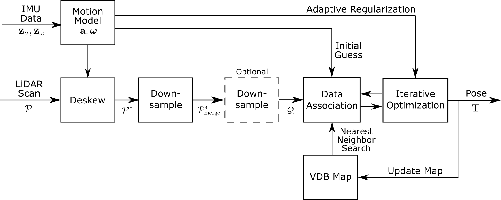
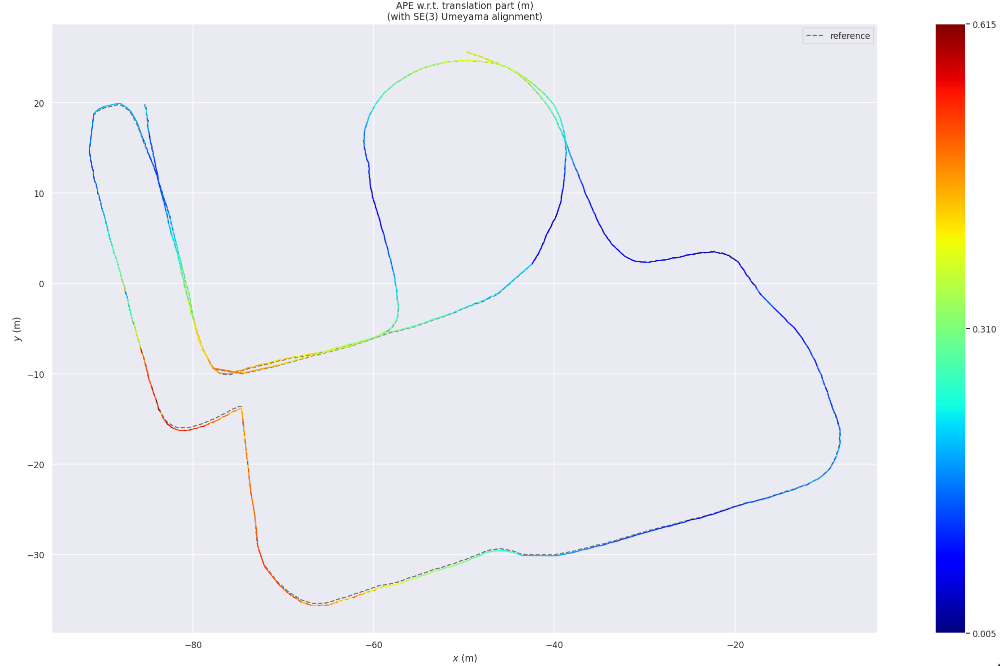
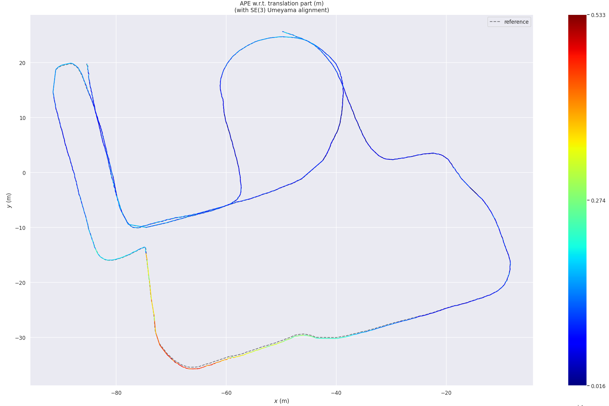
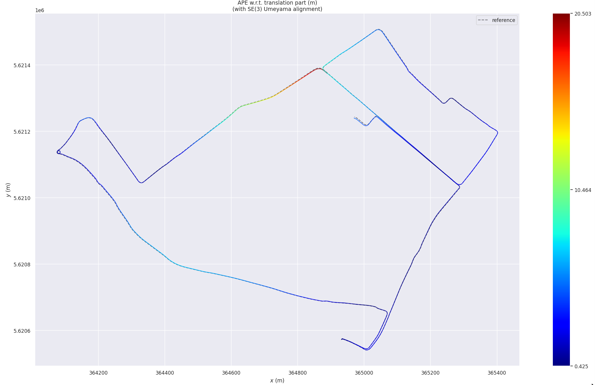
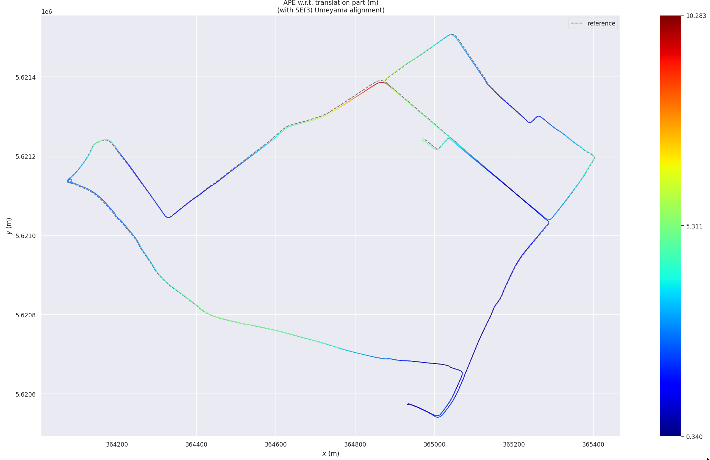
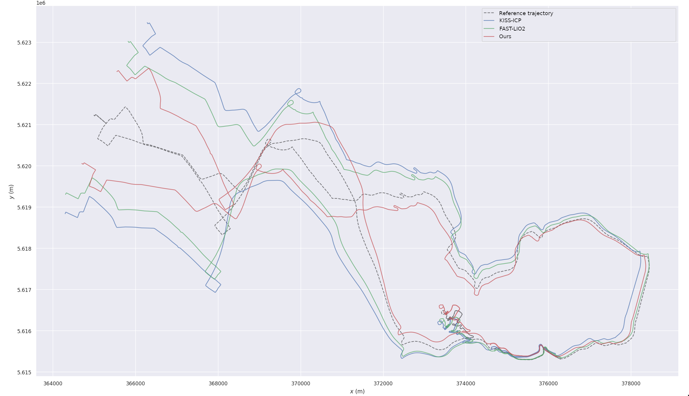

:orphan:

RA-L Supplementary Material
---------------------------

This page is the supplementary material for our RA-L paper (`IEEE <https://doi.org/10.1109/LRA.2026.3685966>`_ | `arXiv <https://arxiv.org/abs/2509.06593>`_).
The main page of the documentation is `here <index.html>`__.

System Pipeline
===============

   **Fig 1:** Pipeline of the LiDAR-inertial odometry system.

The motion model computes average acceleration :math:`\bar{\mathbf{a}}` and angular velocity :math:`\bar{\boldsymbol{\omega}}` for the window of IMU measurements between two LiDAR scans. These control inputs are used to deskew the incoming LiDAR scan :math:`\mathcal{P}` into the deskewed scan :math:`\mathcal{P}^*`.

The deskewed scan is first downsampled to :math:`\mathcal{P}^*_{merge}` (which is later used to update the map). An optional second downsampling step produces :math:`\mathcal{Q}`; if this second step is disabled, :math:`\mathcal{Q} = \mathcal{P}^*_{merge}`.

For registration, :math:`\mathcal{Q}` is matched against the VDB-based map by computing data associations via a nearest neighbor search with an association threshold. The motion model provides the initial guess for the first iteration of the optimization, while subsequent iterations use the current best estimate.

The iterative optimization minimizes a joint cost: an ICP cost from the associations, and an orientation regularization cost. The final estimated pose :math:`\mathbf{T}` (after convergence) is used to transform :math:`\mathcal{P}^*_{merge}` and update the map.

Trajectory Plots
================

In this section, we present trajectory plots using ``evo_ape`` (Absolute Pose Error). The trajectories are colored based on error magnitude, where "hotter" colors (reds/yellows) indicate higher error.

Oxford Spires (Radcliffe)
^^^^^^^^^^^^^^^^^^^^^^^^^

   **Fig 2:** Odometry result when adaptive regularization is disabled (``no-AR`` ablation in the paper) on Oxford Spires Radcliffe sequence.

   **Fig 3:** Full odometry system result (``Ours`` ablation in the paper) on Oxford Spires Radcliffe sequence.

Shown above are two trajectory results when ablating the performance of the odometry system. The color scale represents the APE error. Please note that the range of error (color bar scale) is different in both plots; the full system trajectory has a lower total error than the no-regularization version. From this comparison, it can be seen that the full system (``Ours``) performs better on this sequence.

Car Dataset (Urban)
^^^^^^^^^^^^^^^^^^^

   **Fig 4:** Odometry result when adaptive regularization is disabled (``no-AR`` ablation in the paper) on Car (Urban) sequence.

   **Fig 5:** Full odometry system result (``Ours`` ablation in the paper) on Car (Urban) sequence.

Similar to the Oxford Spires results, we once again see the full system performs (``Ours``) better than the ablated version (``no-AR``).

Car Dataset (Rural)
^^^^^^^^^^^^^^^^^^^

   **Fig 8:** Trajectory comparison of multiple methods on the Car (Rural) sequence.

Here we plot the full XY trajectory results from all the methods which successfully ran on the rural sequence. The trajectories have been aligned (using Umeyama alignment) to the reference trajectory, which is defined in a GPS coordinate frame. Each approach experiences significant drift on this 50 km long sequence, and as a consequence of the alignment process, the trajectories appear well-aligned near the middle of the sequence but drift at the ends. Nevertheless, we see that our approach (red) is the one that remains closest to the reference trajectory overall.

Citation
========

If you use this work, please leave a star on our `GitHub repository <https://github.com/PRBonn/rko_lio>`_ and consider citing our paper (`RA-L <https://doi.org/10.1109/LRA.2026.3685966>`_ | `arXiv <https://arxiv.org/abs/2509.06593>`_):

.. code-block:: bibtex

  @article{malladi2026ral,
    author      = {M.V.R. Malladi and T. Guadagnino and L. Lobefaro and C. Stachniss},
    title       = {A Robust Approach for LiDAR-Inertial Odometry Without Sensor-Specific Modeling},
    journal     = {IEEE Robotics and Automation Letters},
    year        = {2026},
    volume      = {11},
    number      = {6},
    pages       = {7420--7427},
    doi         = {10.1109/LRA.2026.3685966},
  }
